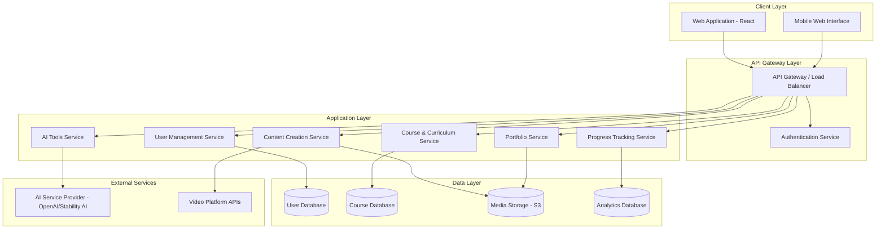

# Design Document: AI Content Education Platform

## Overview

The AI Content Education Platform is a web-based educational system that integrates content creation and AI literacy into formal education curricula. The platform serves three primary user roles: Students who learn and create content, Educators who design curricula and monitor progress, and Administrators who manage institutional settings.

The system architecture follows a modern three-tier design with a React-based frontend, RESTful API backend, and cloud-based storage for media assets. The platform integrates third-party AI services for thumbnail generation and provides structured learning paths that combine theoretical knowledge with hands-on practice.

Key design principles:
- **Modularity**: Learning modules are independent and can be mixed/matched by institutions
- **Scalability**: Cloud-native architecture supports growth from single classrooms to entire districts
- **Accessibility**: Mobile-first responsive design ensures access across devices
- **Privacy-first**: Student data protection is built into every component

## Architecture

### System Components



### Technology Stack

**Frontend:**
- React 18+ with TypeScript for type safety
- Redux Toolkit for state management
- React Router for navigation
- Tailwind CSS for responsive styling
- React Query for server state management

**Backend:**
- Node.js with Express.js framework
- TypeScript for type safety
- JWT for authentication
- PostgreSQL for relational data
- Redis for caching and session management
- AWS S3 for media storage

**AI Integration:**
- OpenAI API for text generation and analysis
- Stability AI or DALL-E for thumbnail generation
- Custom prompt engineering layer for educational context

**Infrastructure:**
- Docker containers for service deployment
- Kubernetes for orchestration (production)
- AWS/GCP for cloud hosting
- CloudFront/CDN for media delivery

## Components and Interfaces

### 1. Authentication Service

**Responsibilities:**
- User registration and login
- JWT token generation and validation
- Role-based access control (RBAC)
- Password reset and account recovery

**Key Interfaces:**

```typescript
interface AuthService {
  register(credentials: UserCredentials, role: UserRole): Promise<AuthResult>
  login(email: string, password: string): Promise<AuthResult>
  validateToken(token: string): Promise<TokenValidation>
  refreshToken(refreshToken: string): Promise<AuthResult>
  resetPassword(email: string): Promise<void>
}

interface UserCredentials {
  email: string
  password: string
  fullName: string
  institutionId?: string
}

enum UserRole {
  STUDENT = 'student',
  EDUCATOR = 'educator',
  ADMINISTRATOR = 'administrator'
}

interface AuthResult {
  accessToken: string
  refreshToken: string
  user: UserProfile
  expiresIn: number
}
```

### 2. Course and Curriculum Service

**Responsibilities:**
- Learning path creation and management
- Lesson content storage and retrieval
- Curriculum versioning
- Course enrollment management

**Key Interfaces:**

```typescript
interface CourseService {
  createLearningPath(path: LearningPathInput): Promise<LearningPath>
  updateLearningPath(id: string, updates: Partial<LearningPathInput>): Promise<LearningPath>
  getLearningPath(id: string): Promise<LearningPath>
  enrollStudent(studentId: string, pathId: string): Promise<Enrollment>
  getStudentCourses(studentId: string): Promise<LearningPath[]>
}

interface LearningPath {
  id: string
  title: string
  description: string
  moduleType: 'content_creation' | 'ai_education' | 'platform_exposure'
  lessons: Lesson[]
  prerequisites: string[]
  estimatedDuration: number
  createdBy: string
  version: number
}

interface Lesson {
  id: string
  title: string
  content: LessonContent
  order: number
  type: 'video' | 'interactive' | 'reading' | 'exercise'
  resources: Resource[]
  assessment?: Assessment
}
```

### 3. AI Tools Service

**Responsibilities:**
- Thumbnail generation using AI models
- AI prompt management and optimization
- Rate limiting and cost control
- Result caching for common requests

**Key Interfaces:**

```typescript
interface AIToolsService {
  generateThumbnail(request: ThumbnailRequest): Promise<ThumbnailResult>
  customizeThumbnail(thumbnailId: string, customization: ThumbnailCustomization): Promise<ThumbnailResult>
  exportThumbnail(thumbnailId: string, format: ExportFormat): Promise<Buffer>
  getAIGuidance(context: LearningContext): Promise<AIGuidance>
}

interface ThumbnailRequest {
  videoTitle: string
  description: string
  targetPlatform: 'youtube' | 'facebook' | 'instagram' | 'tiktok'
  style?: 'professional' | 'casual' | 'educational' | 'entertainment'
  colorScheme?: string[]
}

interface ThumbnailResult {
  id: string
  imageUrl: string
  variations: ThumbnailVariation[]
  metadata: {
    dimensions: { width: number; height: number }
    fileSize: number
    generatedAt: Date
  }
}

interface ThumbnailCustomization {
  text?: string
  textColor?: string
  backgroundColor?: string
  layout?: 'left' | 'center' | 'right'
}
```

### 4. Content Creation Service

**Responsibilities:**
- Content workflow management
- Integration with video editing tool tutorials
- Content publication tracking
- Template and preset library

**Key Interfaces:**

```typescript
interface ContentCreationService {
  startWorkflow(type: ContentType, platform: Platform): Promise<ContentWorkflow>
  updateWorkflowStep(workflowId: string, stepId: string, data: any): Promise<ContentWorkflow>
  completeWorkflow(workflowId: string): Promise<PublishedContent>
  getWorkflowTemplates(platform: Platform): Promise<WorkflowTemplate[]>
  saveToPortfolio(contentId: string, studentId: string): Promise<PortfolioItem>
}

interface ContentWorkflow {
  id: string
  type: ContentType
  platform: Platform
  steps: WorkflowStep[]
  currentStep: number
  status: 'in_progress' | 'completed' | 'abandoned'
  createdAt: Date
}

interface WorkflowStep {
  id: string
  title: string
  description: string
  order: number
  completed: boolean
  data?: any
  guidance: string[]
}

enum ContentType {
  VIDEO = 'video',
  IMAGE = 'image',
  ARTICLE = 'article',
  SOCIAL_POST = 'social_post'
}

enum Platform {
  YOUTUBE = 'youtube',
  FACEBOOK = 'facebook',
  INSTAGRAM = 'instagram',
  TIKTOK = 'tiktok',
  TWITTER = 'twitter'
}
```

### 5. Progress Tracking Service

**Responsibilities:**
- Activity logging and completion tracking
- Analytics aggregation
- Performance metrics calculation
- Notification triggers for educators

**Key Interfaces:**

```typescript
interface ProgressTrackingService {
  recordActivity(activity: LearningActivity): Promise<void>
  getStudentProgress(studentId: string): Promise<StudentProgress>
  getClassAnalytics(classId: string): Promise<ClassAnalytics>
  generateProgressReport(studentId: string, dateRange: DateRange): Promise<ProgressReport>
  checkMilestones(studentId: string): Promise<Milestone[]>
}

interface LearningActivity {
  studentId: string
  activityType: 'lesson_complete' | 'assessment_submit' | 'content_create' | 'peer_review'
  resourceId: string
  timestamp: Date
  duration?: number
  score?: number
  metadata?: Record<string, any>
}

interface StudentProgress {
  studentId: string
  enrolledPaths: EnrollmentProgress[]
  completionRate: number
  totalTimeSpent: number
  skillsAcquired: Skill[]
  recentActivities: LearningActivity[]
}

interface EnrollmentProgress {
  learningPathId: string
  lessonsCompleted: number
  totalLessons: number
  currentLesson: string
  lastAccessedAt: Date
  performanceScore: number
}
```

### 6. Portfolio Service

**Responsibilities:**
- Portfolio page generation
- Project showcase management
- Certificate and badge issuance
- Shareable link generation

**Key Interfaces:**

```typescript
interface PortfolioService {
  createPortfolio(studentId: string): Promise<Portfolio>
  addProject(portfolioId: string, project: ProjectInput): Promise<Portfolio>
  updatePortfolio(portfolioId: string, updates: PortfolioUpdate): Promise<Portfolio>
  generateShareableLink(portfolioId: string): Promise<string>
  issueCertificate(studentId: string, achievement: Achievement): Promise<Certificate>
}

interface Portfolio {
  id: string
  studentId: string
  displayName: string
  bio: string
  projects: Project[]
  skills: Skill[]
  certificates: Certificate[]
  shareableUrl: string
  visibility: 'public' | 'private' | 'institution_only'
}

interface Project {
  id: string
  title: string
  description: string
  type: ContentType
  platform: Platform
  mediaUrl: string
  thumbnailUrl: string
  createdAt: Date
  tags: string[]
}
```

## Data Models

### User Model

```typescript
interface User {
  id: string
  email: string
  passwordHash: string
  fullName: string
  role: UserRole
  institutionId?: string
  profilePictureUrl?: string
  createdAt: Date
  lastLoginAt: Date
  preferences: UserPreferences
  status: 'active' | 'suspended' | 'deleted'
}

interface UserPreferences {
  language: string
  timezone: string
  emailNotifications: boolean
  theme: 'light' | 'dark'
}
```

### Institution Model

```typescript
interface Institution {
  id: string
  name: string
  type: 'school' | 'college' | 'university' | 'training_center'
  address: Address
  adminIds: string[]
  settings: InstitutionSettings
  branding: BrandingConfig
  subscriptionTier: 'free' | 'basic' | 'premium' | 'enterprise'
  createdAt: Date
}

interface InstitutionSettings {
  allowStudentCollaboration: boolean
  requireEducatorApproval: boolean
  enablePublicPortfolios: boolean
  maxStudentsPerClass: number
}
```

### Learning Path Model

```typescript
interface LearningPath {
  id: string
  title: string
  description: string
  moduleType: 'content_creation' | 'ai_education' | 'platform_exposure'
  difficulty: 'beginner' | 'intermediate' | 'advanced'
  lessons: Lesson[]
  prerequisites: string[]
  estimatedDuration: number
  createdBy: string
  institutionId?: string
  version: number
  published: boolean
  tags: string[]
}
```

### Assessment Model

```typescript
interface Assessment {
  id: string
  lessonId: string
  title: string
  type: 'quiz' | 'project' | 'practical'
  questions: Question[]
  passingScore: number
  timeLimit?: number
  attempts: number
}

interface Question {
  id: string
  type: 'multiple_choice' | 'true_false' | 'short_answer' | 'practical_task'
  prompt: string
  options?: string[]
  correctAnswer?: string | string[]
  points: number
  explanation?: string
}
```

### Content Workflow Model

```typescript
interface ContentWorkflow {
  id: string
  studentId: string
  type: ContentType
  platform: Platform
  steps: WorkflowStep[]
  currentStep: number
  status: 'in_progress' | 'completed' | 'abandoned'
  createdAt: Date
  updatedAt: Date
  publishedUrl?: string
}
```

## Database Schema

### PostgreSQL Tables

**users**
- id (UUID, PRIMARY KEY)
- email (VARCHAR, UNIQUE)
- password_hash (VARCHAR)
- full_name (VARCHAR)
- role (ENUM)
- institution_id (UUID, FOREIGN KEY)
- profile_picture_url (VARCHAR)
- created_at (TIMESTAMP)
- last_login_at (TIMESTAMP)
- preferences (JSONB)
- status (ENUM)

**institutions**
- id (UUID, PRIMARY KEY)
- name (VARCHAR)
- type (ENUM)
- address (JSONB)
- settings (JSONB)
- branding (JSONB)
- subscription_tier (ENUM)
- created_at (TIMESTAMP)

**learning_paths**
- id (UUID, PRIMARY KEY)
- title (VARCHAR)
- description (TEXT)
- module_type (ENUM)
- difficulty (ENUM)
- lessons (JSONB)
- prerequisites (JSONB)
- estimated_duration (INTEGER)
- created_by (UUID, FOREIGN KEY)
- institution_id (UUID, FOREIGN KEY)
- version (INTEGER)
- published (BOOLEAN)
- tags (JSONB)
- created_at (TIMESTAMP)

**enrollments**
- id (UUID, PRIMARY KEY)
- student_id (UUID, FOREIGN KEY)
- learning_path_id (UUID, FOREIGN KEY)
- enrolled_at (TIMESTAMP)
- completed_at (TIMESTAMP)
- progress (JSONB)

**learning_activities**
- id (UUID, PRIMARY KEY)
- student_id (UUID, FOREIGN KEY)
- activity_type (ENUM)
- resource_id (UUID)
- timestamp (TIMESTAMP)
- duration (INTEGER)
- score (FLOAT)
- metadata (JSONB)

**portfolios**
- id (UUID, PRIMARY KEY)
- student_id (UUID, FOREIGN KEY)
- display_name (VARCHAR)
- bio (TEXT)
- projects (JSONB)
- skills (JSONB)
- certificates (JSONB)
- shareable_url (VARCHAR, UNIQUE)
- visibility (ENUM)
- created_at (TIMESTAMP)

**content_workflows**
- id (UUID, PRIMARY KEY)
- student_id (UUID, FOREIGN KEY)
- type (ENUM)
- platform (ENUM)
- steps (JSONB)
- current_step (INTEGER)
- status (ENUM)
- created_at (TIMESTAMP)
- updated_at (TIMESTAMP)
- published_url (VARCHAR)

### Indexes

- users: email, institution_id, role
- learning_paths: created_by, institution_id, module_type, published
- enrollments: student_id, learning_path_id, (student_id, learning_path_id) UNIQUE
- learning_activities: student_id, timestamp, activity_type
- portfolios: student_id, shareable_url


## Correctness Properties

*A property is a characteristic or behavior that should hold true across all valid executions of a system—essentially, a formal statement about what the system should do. Properties serve as the bridge between human-readable specifications and machine-verifiable correctness guarantees.*

### Authentication and User Management Properties

**Property 1: User Registration Creates Valid Accounts**
*For any* valid user credentials and role, when a user registers, the system should create an account that can be retrieved with all provided information intact and the correct role assigned.
**Validates: Requirements 1.1**

**Property 2: Valid Credentials Authenticate Successfully**
*For any* registered user with valid credentials, attempting to login should succeed and return a valid authentication token with appropriate role permissions.
**Validates: Requirements 1.2**

**Property 3: Invalid Credentials Are Rejected**
*For any* invalid credentials (wrong password, non-existent email, or malformed input), login attempts should fail and return an appropriate error message.
**Validates: Requirements 1.3**

**Property 4: Role Changes Update Permissions Immediately**
*For any* user, when an administrator changes their role, subsequent access checks should reflect the new role's permissions without requiring re-authentication.
**Validates: Requirements 1.4**

**Property 5: Role-Based Access Control Enforcement**
*For any* protected resource and any user role, access attempts should succeed only when the user's role has the required permissions for that resource.
**Validates: Requirements 1.5, 15.4**

### Curriculum and Learning Path Properties

**Property 6: Learning Path Data Persistence**
*For any* learning path with lessons and metadata, creating the path then retrieving it should return an equivalent learning path with all lessons in the same order and all metadata preserved.
**Validates: Requirements 2.1, 2.2, 2.3**

**Property 7: Curriculum Updates Create New Versions**
*For any* learning path, when an educator updates the content, the system should create a new version number and trigger notifications to all enrolled students.
**Validates: Requirements 2.5**

### Progress Tracking Properties

**Property 8: Activity Completion Recording**
*For any* learning activity (lesson completion, assessment submission, content creation), when a student completes it, the progress tracker should record the activity with timestamp and performance metrics that can be retrieved in the student's progress history.
**Validates: Requirements 3.3, 8.1**

**Property 9: AI Tool Usage Provides Guidance**
*For any* AI tool interaction, when a student uses the tool, the system should display contextual guidance appropriate to the tool and the student's current learning context.
**Validates: Requirements 3.5**

**Property 10: Progress Display Completeness**
*For any* student with recorded activities, when an educator views their progress, the display should include completion rates, time spent, and skill assessments derived from the activity history.
**Validates: Requirements 8.2**

**Property 11: Progress Report Generation**
*For any* student and date range, generating a progress report should aggregate all activities within that range and produce a report containing individual and comparative analytics.
**Validates: Requirements 8.3**

**Property 12: Behind-Schedule Notifications**
*For any* student who has not completed expected lessons within the learning path timeline, the system should trigger a notification to their assigned educator.
**Validates: Requirements 8.4**

**Property 13: Cross-Module Skill Tracking**
*For any* student completing activities across different module types (content creation, AI education, platform exposure), the system should track and aggregate skills acquired from all modules in their profile.
**Validates: Requirements 8.5**

### AI Tools and Content Creation Properties

**Property 14: Thumbnail Generation Produces Multiple Options**
*For any* valid video title and description, the thumbnail generator should produce at least 2 thumbnail variations within the processing time limit.
**Validates: Requirements 4.1**

**Property 15: Thumbnail Export Format Compliance**
*For any* finalized thumbnail and target platform, exporting the thumbnail should produce an image file that meets the platform's dimension and file size requirements.
**Validates: Requirements 4.3, 4.4**

**Property 16: Video Exercise Submission**
*For any* completed video editing exercise, the system should allow the student to submit it and make it available in the educator's review queue.
**Validates: Requirements 5.4**

**Property 17: Content Workflow Step Progression**
*For any* content workflow, when a student completes a step, the system should record the completion, unlock the next step (if not the final step), and update the workflow status.
**Validates: Requirements 6.1, 6.3**

**Property 18: Content Publication Logging**
*For any* content published through a workflow, the system should create a log entry with publication details that appears in the student's portfolio tracking history.
**Validates: Requirements 6.5**

### Portfolio and Achievement Properties

**Property 19: Portfolio Generation Completeness**
*For any* student with projects, skills, and certificates, generating their portfolio page should include all projects, all acquired skills, and all earned certificates in the shareable output.
**Validates: Requirements 9.2**

**Property 20: Certificate Issuance on Completion**
*For any* learning path, when a student completes all required lessons and assessments, the system should automatically issue a digital certificate with the completion date and learning path details.
**Validates: Requirements 9.3**

**Property 21: Portfolio Version History**
*For any* portfolio, after any update, the system should maintain a version history that allows retrieving previous versions and rolling back to any prior state.
**Validates: Requirements 9.5**

### Institutional Administration Properties

**Property 22: Institution Creation Configuration**
*For any* new institution profile with settings and branding, creating the institution should store all configuration and make it retrievable with all settings intact.
**Validates: Requirements 10.1**

**Property 23: User Organization Management**
*For any* set of users and organizational structure (classes, departments, cohorts), administrators should be able to organize users into groups and retrieve users by their group membership.
**Validates: Requirements 10.2**

**Property 24: Course Enrollment Access Grant**
*For any* student and learning path, when an administrator enrolls the student, the student should immediately have access to all lessons in that learning path.
**Validates: Requirements 10.3**

**Property 25: Bulk User Import Completeness**
*For any* list of valid user records, bulk importing should create accounts for all users in the list, and all created accounts should be retrievable with correct information.
**Validates: Requirements 10.4**

**Property 26: Institutional Report Aggregation**
*For any* institution with multiple users and courses, generating an institutional report should aggregate data across all users and courses within that institution.
**Validates: Requirements 10.5**

### Collaboration Properties

**Property 27: Collaborative Project Invitation**
*For any* collaborative project and list of student collaborators, the project creator should be able to invite all students, and all invited students should receive invitations and gain access to the shared workspace.
**Validates: Requirements 11.1**

**Property 28: Shared Workspace Contributions**
*For any* collaborative project with multiple contributors, all team members should be able to make contributions that are visible to other team members in real-time or near-real-time.
**Validates: Requirements 11.2**

**Property 29: Peer Review Feedback Collection**
*For any* work submitted for peer review, the system should allow designated reviewers to provide structured feedback that is collected and made available to the submitter.
**Validates: Requirements 11.3**

**Property 30: Individual Contribution Tracking**
*For any* collaborative project, the progress tracker should record which student made which contributions, allowing individual contribution history to be retrieved.
**Validates: Requirements 11.5**

### Resource Management Properties

**Property 31: Resource Upload and Searchability**
*For any* educational resource uploaded by an educator, the resource should be stored and become searchable by title, tags, and content, returning the resource in relevant search results.
**Validates: Requirements 12.1**

**Property 32: Content Library Search Relevance**
*For any* search query with keywords and filters, the system should return only resources that match the query criteria, ordered by relevance.
**Validates: Requirements 12.3**

**Property 33: Resource Collection Curation**
*For any* set of resources, educators should be able to create a curated collection, and students should be able to access all resources in the collection as a group.
**Validates: Requirements 12.4**

**Property 34: Resource Update Notifications**
*For any* resource that is updated, the system should identify all students who previously accessed that resource and send them update notifications.
**Validates: Requirements 12.5**

### Offline and Mobile Properties

**Property 35: Offline Material Access**
*For any* learning materials downloaded while online, students should be able to access and view those materials when offline, with progress syncing when connectivity is restored.
**Validates: Requirements 13.5**

### Assessment Properties

**Property 36: Assessment Question Type Support**
*For any* assessment, educators should be able to add questions of multiple types (multiple choice, true/false, short answer, practical task) and all question types should be stored and rendered correctly.
**Validates: Requirements 14.1**

**Property 37: Automatic Grading and Flagging**
*For any* completed assessment, the system should automatically grade all objective questions (multiple choice, true/false) and flag all subjective questions (short answer, practical task) for educator review.
**Validates: Requirements 14.2**

**Property 38: Assessment Feedback Provision**
*For any* completed assessment, the system should provide immediate feedback including score, correct answers, and explanations for incorrect responses.
**Validates: Requirements 14.3**

**Property 39: Assessment History Preservation**
*For any* student, all completed assessments should be stored in history, and students should be able to retrieve and review any past assessment with their responses and scores.
**Validates: Requirements 14.5**

### Privacy and Data Management Properties

**Property 40: Data Export Completeness**
*For any* user requesting their data, the system should generate an export containing all personal information, learning history, created content, and portfolio data associated with that user.
**Validates: Requirements 15.2**

**Property 41: Account Deletion Data Removal**
*For any* user requesting account deletion, the system should remove all personally identifiable information while preserving anonymized learning analytics, and subsequent queries for that user's personal data should return no results.
**Validates: Requirements 15.3**

**Property 42: Audit Log Completeness**
*For any* data access or modification operation, the system should create an audit log entry with timestamp, user, action type, and affected resources that can be retrieved for compliance review.
**Validates: Requirements 15.5**

## Error Handling

### Authentication Errors

- **Invalid Credentials**: Return 401 Unauthorized with message "Invalid email or password"
- **Expired Token**: Return 401 Unauthorized with message "Session expired, please login again"
- **Insufficient Permissions**: Return 403 Forbidden with message "You do not have permission to access this resource"
- **Account Suspended**: Return 403 Forbidden with message "Account suspended, contact administrator"

### Input Validation Errors

- **Missing Required Fields**: Return 400 Bad Request with specific field names
- **Invalid Format**: Return 400 Bad Request with format requirements
- **File Too Large**: Return 413 Payload Too Large with size limit
- **Unsupported File Type**: Return 415 Unsupported Media Type with allowed types

### Resource Errors

- **Not Found**: Return 404 Not Found with resource type and ID
- **Already Exists**: Return 409 Conflict for duplicate resources (e.g., email already registered)
- **Dependency Conflict**: Return 409 Conflict when deletion would break references

### External Service Errors

- **AI Service Unavailable**: Return 503 Service Unavailable, queue request for retry
- **AI Service Rate Limit**: Return 429 Too Many Requests with retry-after header
- **AI Service Timeout**: Return 504 Gateway Timeout, allow user to retry

### Database Errors

- **Connection Failed**: Log error, return 500 Internal Server Error, retry with exponential backoff
- **Query Timeout**: Log slow query, return 504 Gateway Timeout
- **Constraint Violation**: Return 400 Bad Request with constraint details

### Error Response Format

All errors follow a consistent JSON structure:

```json
{
  "error": {
    "code": "ERROR_CODE",
    "message": "Human-readable error message",
    "details": {
      "field": "Additional context"
    },
    "timestamp": "2024-01-15T10:30:00Z",
    "requestId": "uuid"
  }
}
```

### Error Logging

- All errors logged with severity level (ERROR, WARN, INFO)
- Include request ID for tracing
- Log stack traces for 500-level errors
- Sanitize sensitive data before logging
- Aggregate errors for monitoring and alerting

## Testing Strategy

### Dual Testing Approach

The platform requires both unit testing and property-based testing for comprehensive coverage:

**Unit Tests** focus on:
- Specific examples demonstrating correct behavior
- Edge cases (empty inputs, boundary values, special characters)
- Error conditions and exception handling
- Integration points between services
- Mock external dependencies (AI services, databases)

**Property-Based Tests** focus on:
- Universal properties that hold for all inputs
- Comprehensive input coverage through randomization
- Invariants that must be maintained across operations
- Round-trip properties (serialize/deserialize, create/retrieve)
- Relationship properties between related operations

Both testing approaches are complementary and necessary. Unit tests catch concrete bugs in specific scenarios, while property tests verify general correctness across the input space.

### Property-Based Testing Configuration

**Framework Selection:**
- **JavaScript/TypeScript**: Use `fast-check` library
- **Python** (if used for services): Use `hypothesis` library

**Test Configuration:**
- Minimum 100 iterations per property test (due to randomization)
- Each property test must reference its design document property
- Tag format: `Feature: ai-content-education-platform, Property {number}: {property_text}`
- Each correctness property must be implemented by a single property-based test

**Example Property Test Structure:**

```typescript
import fc from 'fast-check';

// Feature: ai-content-education-platform, Property 1: User Registration Creates Valid Accounts
describe('Property 1: User Registration', () => {
  it('should create valid accounts for any valid credentials', () => {
    fc.assert(
      fc.property(
        fc.record({
          email: fc.emailAddress(),
          password: fc.string({ minLength: 8 }),
          fullName: fc.string({ minLength: 1 }),
          role: fc.constantFrom('student', 'educator', 'administrator')
        }),
        async (credentials) => {
          const result = await authService.register(credentials);
          const retrieved = await userService.getUser(result.user.id);
          
          expect(retrieved.email).toBe(credentials.email);
          expect(retrieved.fullName).toBe(credentials.fullName);
          expect(retrieved.role).toBe(credentials.role);
        }
      ),
      { numRuns: 100 }
    );
  });
});
```

### Unit Testing Strategy

**Coverage Targets:**
- Minimum 80% code coverage for business logic
- 100% coverage for authentication and authorization code
- 100% coverage for data validation logic

**Test Organization:**
- Group tests by service/component
- Use descriptive test names following "should [expected behavior] when [condition]"
- Setup and teardown for database state
- Use test fixtures for common data scenarios

**Example Unit Test Structure:**

```typescript
describe('AuthService', () => {
  describe('login', () => {
    it('should return auth token when credentials are valid', async () => {
      const user = await createTestUser({ email: 'test@example.com', password: 'password123' });
      const result = await authService.login('test@example.com', 'password123');
      
      expect(result.accessToken).toBeDefined();
      expect(result.user.id).toBe(user.id);
    });
    
    it('should reject login when password is incorrect', async () => {
      await createTestUser({ email: 'test@example.com', password: 'password123' });
      
      await expect(
        authService.login('test@example.com', 'wrongpassword')
      ).rejects.toThrow('Invalid email or password');
    });
    
    it('should reject login when email does not exist', async () => {
      await expect(
        authService.login('nonexistent@example.com', 'password123')
      ).rejects.toThrow('Invalid email or password');
    });
  });
});
```

### Integration Testing

- Test complete workflows end-to-end
- Test service-to-service communication
- Test database transactions and rollbacks
- Test external API integrations with mocked responses
- Test authentication flow across multiple requests

### Performance Testing

- Load testing for concurrent users (target: 1000 concurrent users)
- Stress testing for AI service rate limits
- Database query performance testing
- Media upload/download performance testing
- API response time targets: p95 < 500ms, p99 < 1000ms

### Security Testing

- Penetration testing for authentication vulnerabilities
- SQL injection testing on all database queries
- XSS testing on user-generated content
- CSRF protection verification
- Rate limiting verification
- Data encryption verification

### Accessibility Testing

- WCAG 2.1 Level AA compliance
- Screen reader compatibility testing
- Keyboard navigation testing
- Color contrast verification
- Mobile accessibility testing
